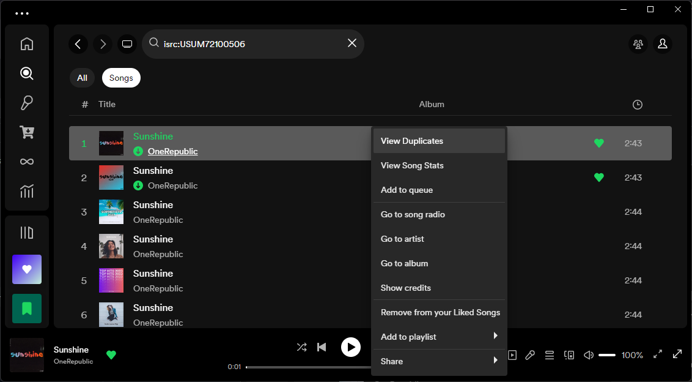
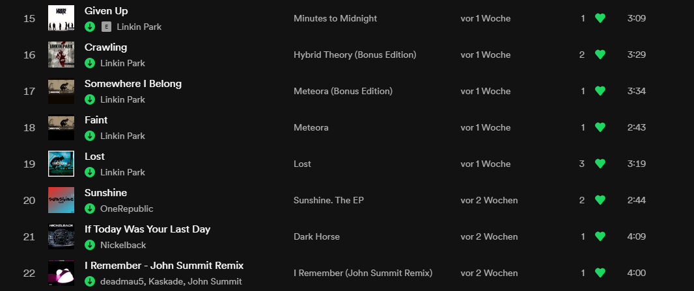

# find-duplicates
[Spicetify](https://github.com/spicetify/spicetify-cli) extension to view all releases of a song. 
* Right click a song and select "View Duplicates" to see a list of all it's releases.
* Look at the indicator next to a song's heart icon to see how many duplicates of that song you have saved.

##  Usage
- Right click a song and select "View Duplicates".
- **Note**: On it's first launch, the extension has to build a list of International Standard Recording Codes for the songs saved in your library. During this time, the "View Duplicates" feature may not be available for every song. You will see an error message instead.

